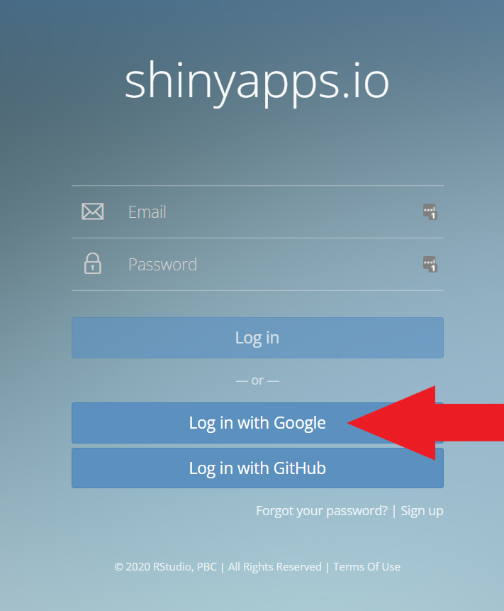
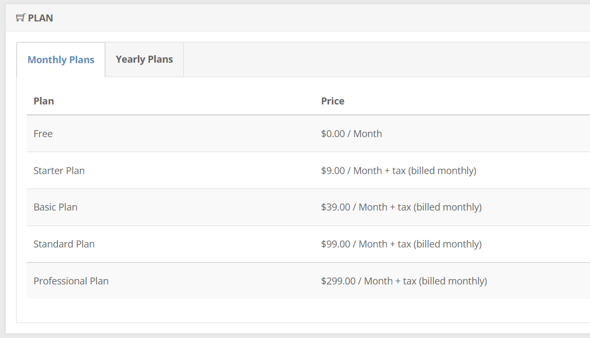

# R Shiny Applications

The Shiny web applications for the course are managed in the `web_applications` repository in the course GitHub organization (direct link: https://code.harvard.edu/DSM/web_applications). They are published through shinyapps.io.

RStudio has excellent materials that teach how to build apps with Shiny and how to publish those web applications online through shinyapps.io. Work through the following tutorials:

1. [Building Web Applications with Shiny](https://rstudio-education.github.io/shiny-course/)
	+ Be sure to work through the section `Running the app locally`.
2. [Getting started with shinyapps.io](https://shiny.rstudio.com/articles/shinyapps.html)
	+ Do not create a new shinyapps.io account as part of this tutorial; you should instead use the official DSM faculty Google account (dsmfaculty@gmail.com). Do this by selecting `Log in with Google` at shinyapps.io (see image below).

<kbd>

</kbd>	

After working through these tutorials, you should know how to manage the course Shiny apps and publish them through shinyapps.io.

## Billing

Part of the course budget is used to pay for the hosting of our web applications through shinyapps.io. To manage billing, log in to the DSM Faculty Google account on [shinyapps.io](https://shinyapps.io/). Select the `Billing` tab under `Account` to see the current plan (image below). The documentation [here](https://docs.rstudio.com/shinyapps.io/billing-and-account-management.html) describes the features offered by the different plan options. 

<kbd>

</kbd>

When the course is in session and students are accessing the web applications, it is very important to understand the scaling settings for the applications. These settings determine how many machines and worker processes are spun up as users start accessing an application. You can read about these settings [here](https://docs.rstudio.com/shinyapps.io/applications.html#advanced-settings). 